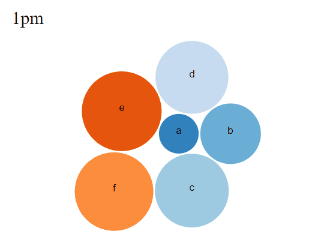

# MovingBubbles : Animated d3 bubble chart
The package provides a method to add the second information dimension, which can be either qualitative or quantitative, to the chart by means of animation. The plotting and transitions between frames are handled by [d3 library](https://d3js.org/). The package uses [htmlwidgets](https://www.htmlwidgets.org/) framework to bridge Javascript and R.

# Usage & Demo
The function takes in a data.frame and column names for key, value, frame and optional color columns. The frame column will be factorized if not already and the order of factor levels will be used to run the animation sequentially. Thus, the sequence can be defined by manually setting the levels of the frame column.

    library(MovingBubbles)
    dat <- data.frame(alphabets = rep(letters[1:6],5),
                      size = round(runif(30)*100),
                      time = rep(paste0(1:5, "pm"), each = 6))
    dat$time <- factor(dat$time, levels = rep(paste0(1:5, "pm")))
    MovingBubbles(dat, key = "alphabets", value = "size", frame = "time")
    

# Installation
The latest development version:

    devtools::install_github("chengvt/MovingBubbles", dependencies = TRUE)

# TODO
- Make transition from frame to frame to be more aware of their previous location
- Zoomable bubbles with option for listing more details when zoomed in
